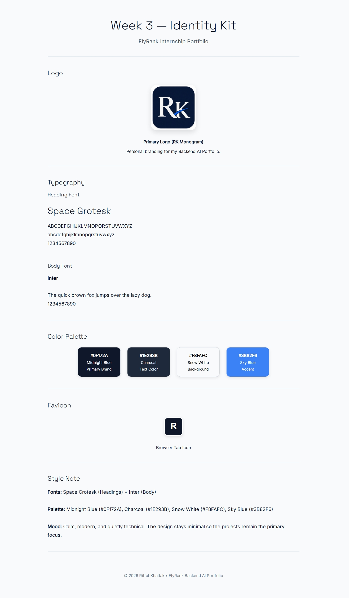

# Week 3 — Identity Kit

## Assignment
**Decide Once: Build Your Identity Kit — FlyRank Internship**

---

# Identity Kit Preview



---

# Overview

This project contains the visual identity system for my FlyRank Backend AI Portfolio.

The goal of this assignment was to create a consistent design system that can be reused across every future portfolio page. Instead of making new design decisions every time, this identity kit defines the typography, color palette, logo, favicon, and visual style in one place.

The design follows a clean, modern, and minimal approach so the projects remain the main focus.

---

# Project Contents

| File | Description |
|------|-------------|
| `index.html` | Identity Kit webpage showing typography, logo, color palette, favicon, and style guide. |
| `style.css` | Styling for the Identity Kit page. |
| `favicon.svg` | Simple RK favicon used for browser tabs. |
| `assets/logo.png` | RK Monogram logo. |
| `screenshots/identity-kit-preview.png` | Screenshot of the completed Identity Kit. |
| `README.md` | Project documentation. |

---

# Typography

### Heading Font

**Space Grotesk**

Used for:

- Main headings
- Section titles
- Portfolio branding

### Body Font

**Inter**

Used for:

- Paragraphs
- Descriptions
- Portfolio content

Keeping only two fonts creates a clean and consistent visual identity.

---

# Color Palette

| Color | Hex Code | Usage |
|--------|----------|-------|
| Midnight Blue | `#0F172A` | Primary Brand |
| Charcoal | `#1E293B` | Text Color |
| Snow White | `#F8FAFC` | Background |
| Sky Blue | `#3B82F6` | Accent |

The palette is intentionally minimal to keep attention on the portfolio projects rather than decorative elements.

---

# Logo

The primary logo is an **RK Monogram** representing my personal brand.

It is used throughout the portfolio to provide a simple and recognizable identity while maintaining a professional appearance.

---

# Favicon

A simplified **RK favicon** is included for browser tabs and bookmarks, keeping the branding consistent across the website.

---

# Style Note

**Fonts**

- Space Grotesk (Headings)
- Inter (Body)

**Palette**

- Midnight Blue (#0F172A)
- Charcoal (#1E293B)
- Snow White (#F8FAFC)
- Sky Blue (#3B82F6)

**Mood**

Clean, modern, and quietly technical. The design stays minimal so the projects remain the primary focus.

---

# Folder Structure

```text
W3-A1(Identity-Kit)
│
├── assets
│   └── logo.png
│
├── screenshots
│   └── identity-kit-preview.png
│
├── favicon.svg
├── index.html
├── style.css
└── README.md
```

---

# Usage

Open `index.html` in any modern web browser.

No installation or build process is required.

---

# Assignment Checklist

- ✅ One heading font and one body font
- ✅ Professional color palette with hex codes
- ✅ Simple RK logo
- ✅ Favicon included
- ✅ Two-line style note
- ✅ Identity Kit preview
- ✅ Consistent branding
- ✅ Responsive HTML & CSS layout

---

## Author

**Riffat **

FlyRank Backend AI Portfolio Cohort Jukly 2026.

Week 3 — Identity Kit