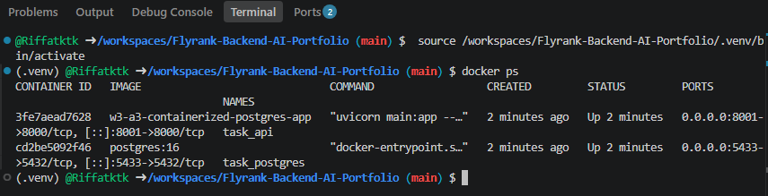
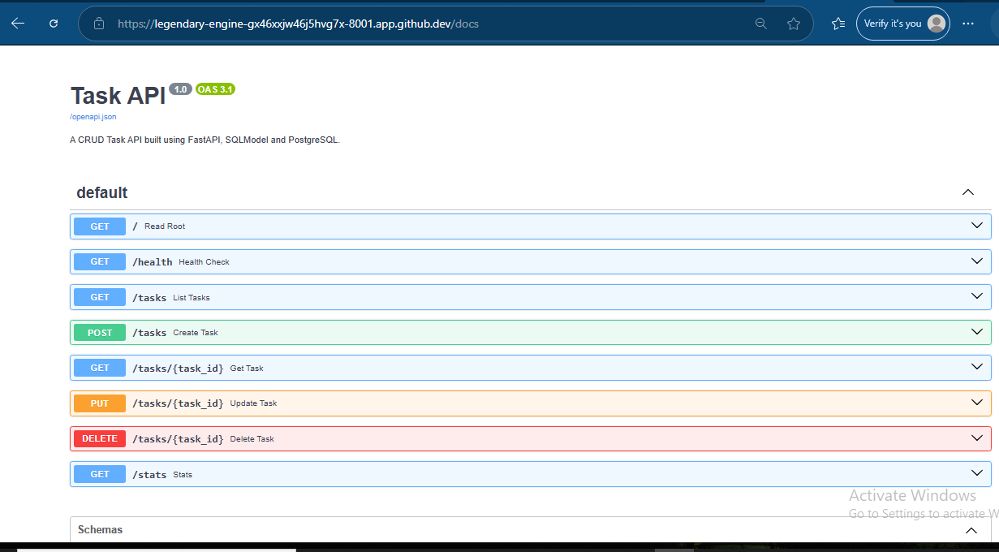
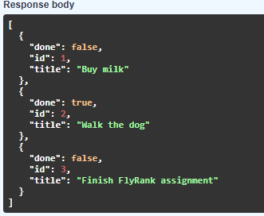
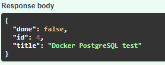
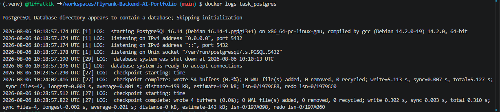
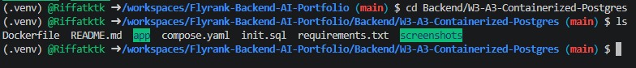

# W3-A3 — Containerized PostgreSQL Task API

FlyRank Internship  
Backend Track — Week 3 Assignment A3

## Overview

This project is a FastAPI CRUD Task API migrated from SQLite storage to PostgreSQL and containerized using Docker.

The API functionality remains the same as Week 3 A2, but the database layer has been changed:

**SQLite → PostgreSQL**

The complete application stack runs using Docker Compose:

- FastAPI application container
- PostgreSQL database container


## Tech Stack

- FastAPI
- SQLModel
- PostgreSQL 16
- Docker
- Docker Compose
- Python 3.12


## Project Structure

```
W3-A3-Containerized-Postgres/
│
├── app/
│   ├── main.py
│   ├── database.py
│   ├── models.py
│   ├── repository.py
│   ├── schemas.py
│   ├── seed.py
│   └── __init__.py
│
├── screenshots/
│   ├── 01-docker-containers-running.png
│   ├── 02-swagger-docs.png
│   ├── 03-get-tasks.png
│   ├── 04-create-task.png
│   ├── 05-postgres-running.png
│   └── 06-project-structure.png
│
├── Dockerfile
├── compose.yaml
├── init.sql
├── requirements.txt
└── README.md
```


## Running the Application

### 1. Build and start containers

```bash
docker compose up --build
```

This starts:

- FastAPI server
- PostgreSQL database


### 2. API Documentation

Open:

```
http://localhost:8001/docs
```

Swagger UI provides interactive API testing.


## Database Configuration

The application connects to PostgreSQL using:

```
DATABASE_URL=postgresql://postgres:postgres@db:5432/tasks
```

The database runs inside the Docker network using the PostgreSQL service name:

```
db
```


## API Endpoints

### Health Check

```
GET /health
```

Response:

```json
{
  "status": "ok"
}
```


### Get All Tasks

```
GET /tasks
```


### Get Single Task

```
GET /tasks/{task_id}
```


### Create Task

```
POST /tasks
```

Example:

```json
{
  "title": "Docker PostgreSQL Test"
}
```


### Update Task

```
PUT /tasks/{task_id}
```


### Delete Task

```
DELETE /tasks/{task_id}
```


### Task Statistics

```
GET /stats
```


## Verification Screenshots

### Docker Containers Running




### Swagger Documentation




### GET Tasks Response




### Create Task Response




### PostgreSQL Running




### Project Structure




## Environment Variables

A `.env.example` file is included for configuration reference.

The actual `.env` file is ignored by Git because it contains local configuration values.


## Docker Commands

Stop containers:

```bash
docker compose down
```

View running containers:

```bash
docker ps
```

View PostgreSQL logs:

```bash
docker logs task_postgres
```


## Assignment Result

Successfully completed:

✅ FastAPI CRUD API  
✅ SQLite replaced with PostgreSQL  
✅ Dockerized application  
✅ PostgreSQL container configured  
✅ Docker Compose setup  
✅ API tested through Swagger UI  
